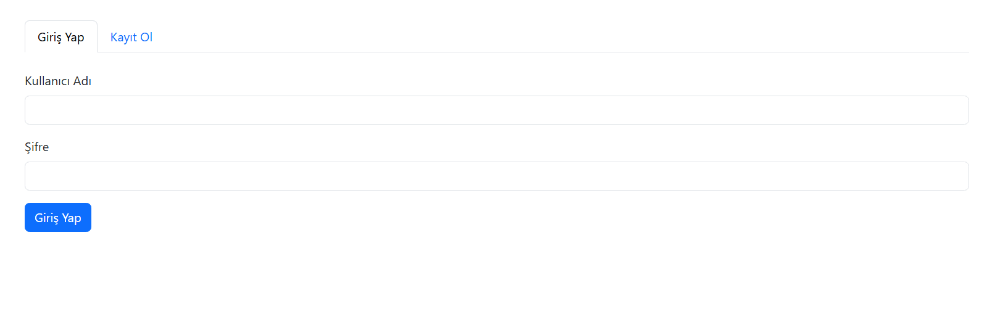
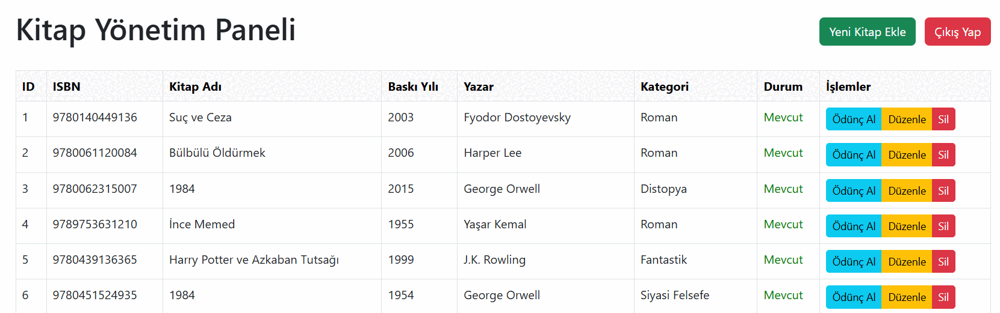
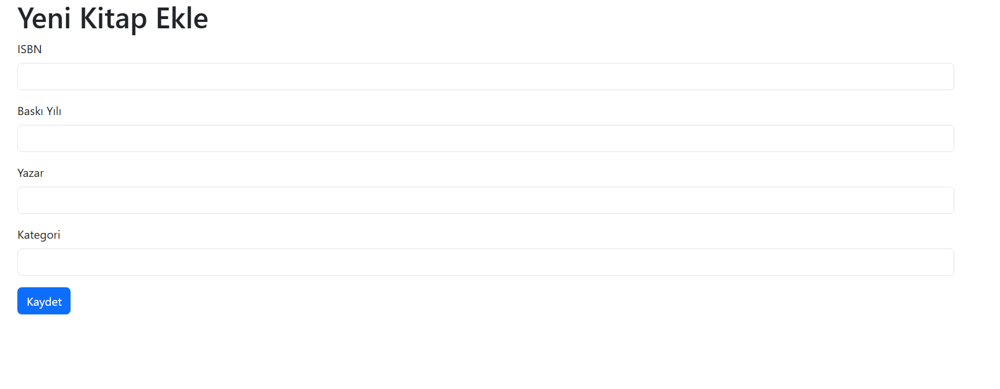
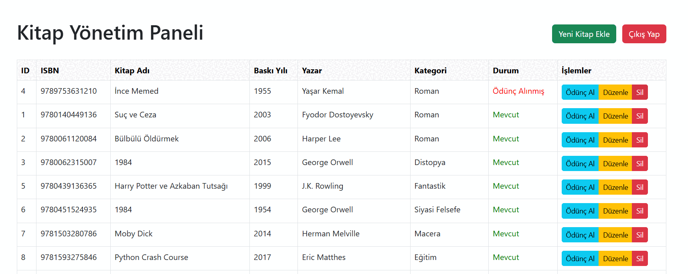
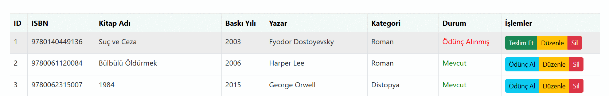

# Yzm-311_VT_Kutuphane: Kütüphane Sistemi Web Sitesi

### **Geliştiren**
Ad Soyad: Beyzanur Saygıner  
Öğrenci No: 22290515  
Ders Kodu: YZM311  

## **Proje Açıklaması**
Bu proje, bir kütüphane yönetim sistemi oluşturur. Kullanıcılar sisteme giriş yapabilir, kitapları listeleyebilir, yeni kitaplar ekleyebilir, mevcut kitapları düzenleyebilir ve silebilir.Kitap ödünç alabilirler ve teslim edebilirler.

## **Özellikler**
- Kullanıcı giriş ve kayıt sistemi.
- Kitapların listelenmesi (ID, ISBN,Kita Adı Baskı Yılı, Yazar, Kategori bilgileriyle).
- Yeni kitap ekleme.
- Kitap düzenleme.
- Kitap silme.
- Kitap ödünç alma.
- Kitap teslim etme.

## **Kurulum (Setup)**
Projeyi klonlayıp çalıştırmak için aşağıdaki adımları takip edebilirsiniz:

###  Depoyu Klonla
Öncelikle, projeyi GitHub'dan klonlayın:

 ```bash
git clone https://github.com/BeyzanurSa/Yzm-311_vt_odev.git
cd Yzm-311_vt_odev  
```

### **Gereksinimler**
- **PHP** (v7.4 veya üzeri)
- **MySQL Veritabanı**
- **Apache** veya **XAMPP/WAMP** gibi bir yerel sunucu

### **Veritabanını Ayarla**
PhpMyAdmin'e veya MySQL'e erişin ve aşağıdaki SQL sorgusunu çalıştırarak veritabanını oluşturun:

```sql 
CREATE DATABASE kutuphane;
USE kutuphane;

CREATE TABLE kitaplar (
    id INT AUTO_INCREMENT PRIMARY KEY,
    isbn VARCHAR(13) NOT NULL,
    kitap_adi VARXHAR(255) NOT NULL,
    basim_yili INT NOT NULL,
    yazar VARCHAR(255) NOT NULL,
    kategori VARCHAR(255) NOT NULL
);

CREATE TABLE kullanicilar (
    id INT AUTO_INCREMENT PRIMARY KEY,
    kullanici_adi VARCHAR(255) UNIQUE NOT NULL,
    email VARCHAR(255) UNIQUE NOT NULL,
    parola VARCHAR(255) NOT NULL
);
CREATE TABLE odunc_alma (
    id INT AUTO_INCREMENT PRIMARY KEY,
    kullanici_id INT NOT NULL,
    kitap_id INT NOT NULL,
    odunc_alma_tarihi DATE NOT NULL,
    teslim_tarihi DATE,
    teslim_edildi TINYINT, 
    FOREIGN KEY (kullanici_id) REFERENCES kullanicilar(id),
    FOREIGN KEY (kitap_id) REFERENCES kitaplar(id)
);

INSERT INTO kitaplar (isbn, kitap_adi,basim_yili, yazar, kategori) VALUES
('9780140449136','1984', 2003, 'Fyodor Dostoyevsky', 'Klasik'),
('9780061120084','Bülbülü Öldürmek', 2006, 'Harper Lee', 'Roman');

INSERT INTO kullanicilar (kullanici_adi, email, parola) VALUES
('admin', 'admin@example.com', 'hashed-password');
```
### Projeyi Çalıştır
Proje dizinini htdocs (XAMPP kullanıyorsanız) klasörüne kopyalayın.
Tarayıcınızda şu URL'yi açın:

```bash
Kodu kopyala
http://localhost/Yzm-311_vt_odev/
```

### **Nasıl Çalışır?**

**1. Giriş/Kayıt Ekranı**
Kullanıcılar giriş yapabilir hesabı yoksa yeni hesap oluşturabilir.
şifre yanlışsa uyarı çıkar doğruysa admin paneline yönlendirir.



**2. Kitap Yönetimi**
Kitaplar listelenir, her kitap için düzenle ve sil butonları vardır.



**3. Yeni Kitap Ekleme**
Kullanıcılar, yeni kitap ekleyebilir.


**4. Kitap Düzenleme**
Mevcut kitapların bilgileri düzenlenebilir.


**5. Kitap Silme**
Bir kitabı veritabanından silebilirsiniz.

**6.Kitap ödünç al**
İstediğiniz kitabı ödünç akabilirsiniz otomatik son teslim tarihi 15 gün sonrasına atanacaktır.


**7.Kitap teslim etme**
Ödünç aldığını kitabı teslim edebilirsiniz.


**Projenin Yapısı**
bash
Kodu kopyala
Yzm-311_vt_odev/
│
├── admin.php         # Kitapları listeleme ve yönetim ekranı
├── ekle.php          # Yeni kitap ekleme sayfası
├── duzenle.php       # Kitap düzenleme sayfası
├── sil.php           # Kitap silme işlemi
├── baglanti.php      # Veritabanı bağlantısı
├── kayit.php         # Giriş ve kayıt işlemleri
├── odunc.php         # Ödünç alma işlemlerini 
├── teslim.php        # Teslim etme işlemlerini 
└── exit.php          # Çıkış (giriş ekranına yönlendirir)

